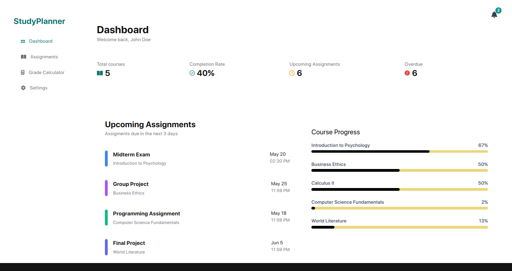

# StudyPlanner

A modern web application designed to help students manage their academic workload, track assignments, and calculate grades effectively.



## Features

- **Assignment Management**
  - Create, edit, and delete assignments
  - Track assignment status (Completed, Pending, In Progress)
  - Filter assignments by course and status
  - Attach files to assignments

- **Course Organization**
  - View all enrolled courses
  - Course-specific assignment tracking
  - Color-coded course identification

- **Grade Calculator**
  - Calculate weighted grades
  - Track individual assignment scores
  - View overall course performance
  - Automatic letter grade calculation

- **User Dashboard**
  - Overview of upcoming assignments
  - Course progress tracking
  - Quick access to important tasks

## Tech Stack

- **Frontend**
  - React.js
  - Vite
  - Tailwind CSS
  - Font Awesome Icons

- **Development Tools**
  - ESLint
  - Git
  - npm

## Getting Started

### Prerequisites

- Node.js (v14 or higher)
- npm (v6 or higher)

### Installation

1. Clone the repository:
   ```bash
   git clone https://github.com/yourusername/StudyPlanner.git
   cd StudyPlanner
   ```

2. Install dependencies:
   ```bash
   npm install
   ```

3. Start the development server:
   ```bash
   npm run dev
   ```

4. Open your browser and navigate to `http://localhost:5173`

## Project Structure

```
StudyPlanner/
├── public/             # Static assets
│   └── db.json        # Mock database
├── src/
│   ├── components/    # React components
│   │   ├── Assignment.jsx
│   │   ├── Dashboard.jsx
│   │   ├── GradeCalculatorPage.jsx
│   │   └── ...
│   ├── App.jsx        # Main application component
│   └── main.jsx       # Application entry point
└── package.json       # Project dependencies
```

## Data Structure

The application uses a JSON-based data structure with the following main entities:

- **Courses**: Contains course information (name, code, instructor)
- **Assignments**: Tracks assignment details (title, due date, status)
- **Grade Items**: Stores grade-related data (scores, weights)
- **Users**: Manages user profiles and preferences

## Contributing

1. Fork the repository
2. Create your feature branch (`git checkout -b feature/AmazingFeature`)
3. Commit your changes (`git commit -m 'Add some AmazingFeature'`)
4. Push to the branch (`git push origin feature/AmazingFeature`)
5. Open a Pull Request

## License

This project is licensed under the MIT License - see the [LICENSE](LICENSE) file for details.

## Acknowledgments

- [React](https://reactjs.org/)
- [Vite](https://vitejs.dev/)
- [Tailwind CSS](https://tailwindcss.com/)
- [Font Awesome](https://fontawesome.com/)

## Contact

Your Name - [@yourtwitter](https://twitter.com/yourtwitter)

Project Link: [https://github.com/yourusername/StudyPlanner](https://github.com/yourusername/StudyPlanner)
